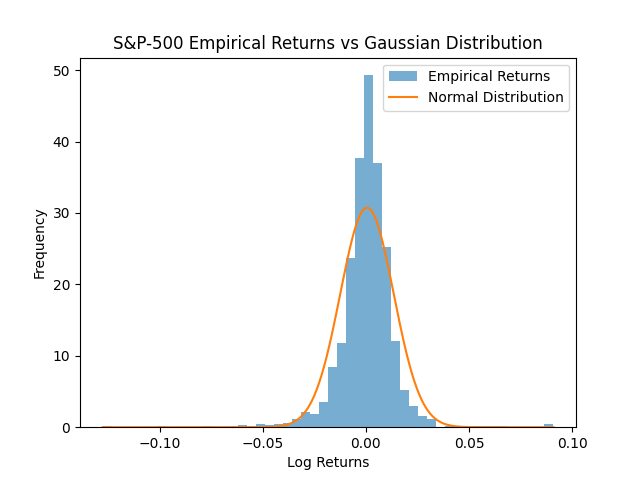
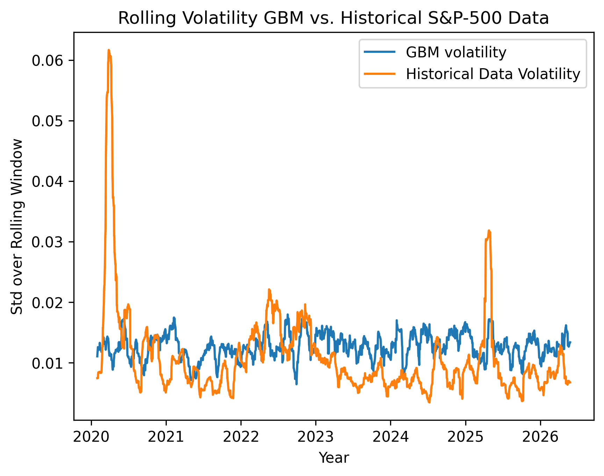
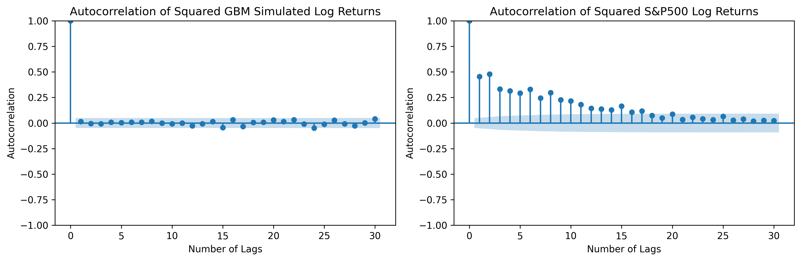

# Asset Return Model Comparison: Geometric Brownian Motion vs. Machine Learning
View the interactive notebook:
[](https://nbviewer.org/github/noellerpaula/gbm_vs_sp500/blob/main/notebooks/analysis.ipynb)

Geometric Brownian Motion (GBM) assumes returns are normally distributed and independent. Neither holds empirically. This project quantifies how large that gap is and tests whether machine learning can close it.
### Summary
- **Data**: S&P-500 daily returns, 2020 - 2026, sourced via yfinance
- **Part 1**: Empirical analysis of return distributions and volatility structure: we reproduce several stylized facts documented in *Empirical properties of asset returns: stylized facts and statistical issues* (Rama Cont, 2001) for our data set
- **Part 2**: GBM calibrated to historical parameters; systematic comparison reveals failure to reproduce heavy tails and volatility clustering
- **Part 3** (in Progress): Machine learning approaches to capture the higher-order statistical structure that GBM fails to reproduce 
## Key Findings of Part 1 and 2:
- The log returns of the S&P-500 data shows significant kurtosis ($\approx$ 17.8 compared to 3 for a Gaussian distribution). Directly overlaying the distribution of empirical data with the distribution of the log returns of GBM paths calibrated with the same mean and variance reveals the GBM significantly underestimate the likelihood of extreme movements (i.e tiny amplitude and large amplitude movements) while overestimating mid-sized movements
- The empirical data also shows significant time variance of volatility as well as volatility clustering. The squared returns show significant autocorrelation with a clear linear decay structure. 
- A GBM model with the same mean and variance, while able to replicate the average amplitude of volatility fluctuations is unable to replicate the same time variance structure in the volatility and shows no volatility clustering. The GBM simulation shows no significant autocorrelation either in log returns or squared log returns. The iid Gaussian increment assumption of the GBM is inconsistent with volatility clustering. 
## Implications of Part 1 and 2:
- The analysis suggests that financial time series cannot fully be characterized by low-order statistics such as mean and variance. Temporal dependence in volatility-related quantities constitutes an important aspect of market dynamics absent from the classical GBM framework.

- The observed differences in the simulated data vs. the historical S&P-500 data are caused directly by the assumptions of the GBM, particularly the assumptions of iid Gaussian increments and constant volatility. While these assumptions yield a mathematically elegant stochastic framework, they do not adequately reproduce the higher-order structure observed in empirical market data. 

- The observed persistence in volatility-related quantities naturally motivates more sophisticated stochastic models that incorporate time-varying or stochastic volatility such as GARCH. This motivates the use of machine learning approaches that can capture time-varying volatility structure, which we explore in Part 3.

## Example Results 

### Heavy-tailed Return Distribution

### Rolling Volatility: Real Data vs GBM

### Autocorrelation of Squared Returns in Historical Data, Absent in GBM


## Requirements
Python 3.12. Install dependencies and the local package via:
```bash
pip install -r requirements.txt
pip install -e .
```
## Repository Structure
```text
hybrid_project          
├───data/
├───images/
├───notebooks
│       └───analysis.ipynb
├───src
│   ├───__init__.py
│   ├───data_loader.py
│   ├───features.py
│   ├───gbm.py
│   └───models.py
├───requirements.txt
├───setup.py
└───README.md
```
## References
Cont, R. (2001). Empirical properties of asset returns: stylized facts and statistical issues. *Quantitative Finance*, 1(2), 223–236.
## Work in Progress
Part 3 (machine learning models) is currently in development. Code and analysis will be added to this repository upon completion.


